# Implementation of IMPALA with Distributed Tensorflow

* These results are from only 20 threads.
* Tensorflow Implementation
* Use distributed tensorflow
* BreakoutDeterministic-v4

```
sh start.sh
```

<div align="center">
  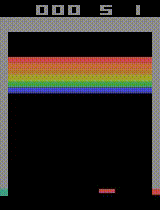
</div>

<div align="center">
  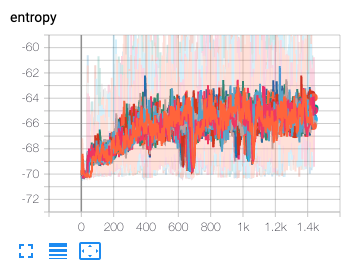
  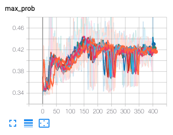
  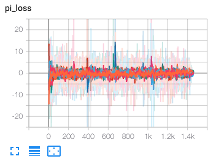
  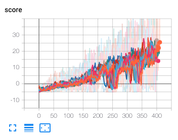
  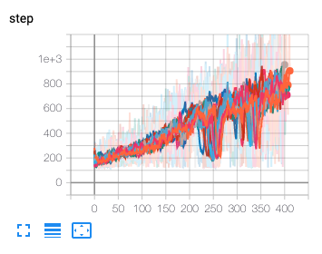
  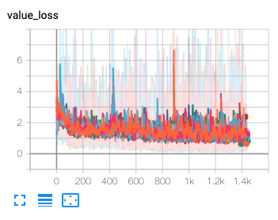
</div>

<div align="center">
  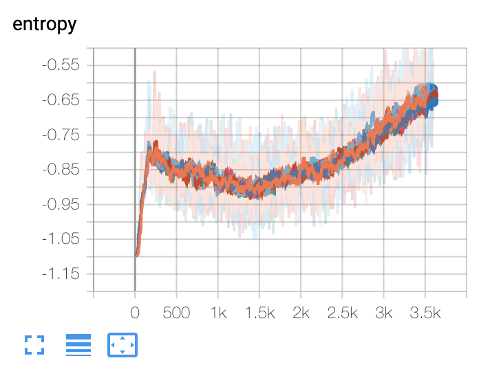
  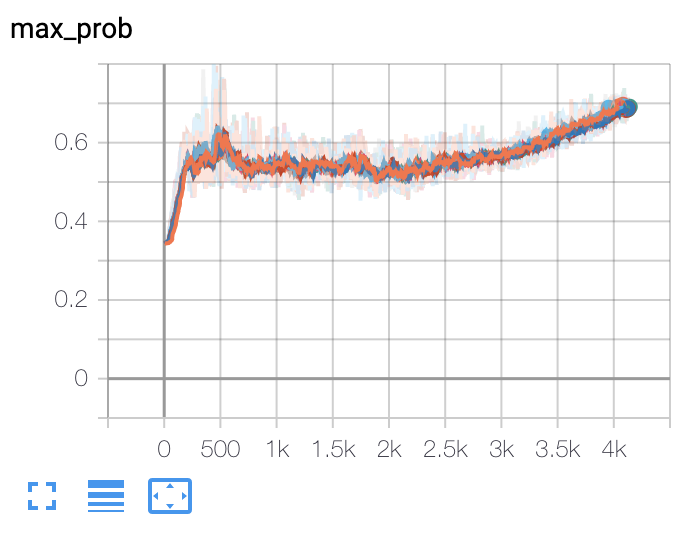
  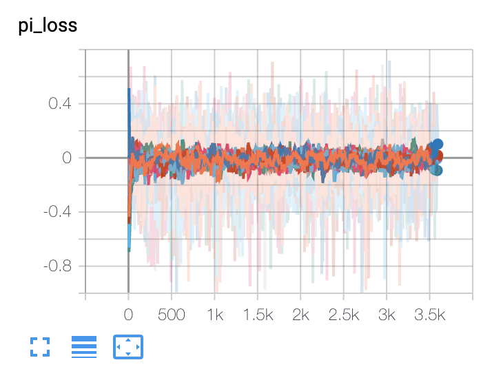
  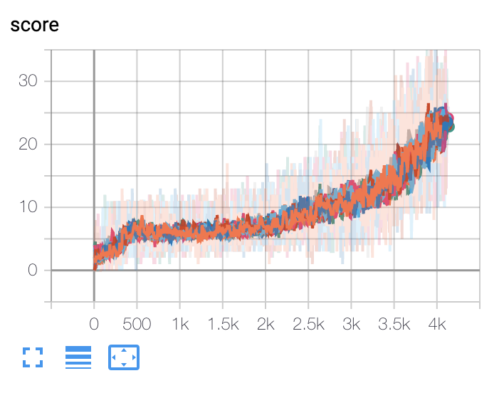
  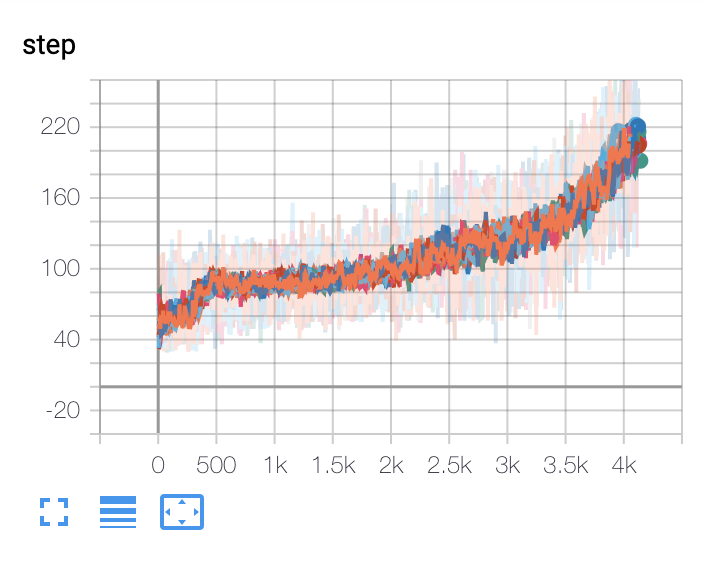
  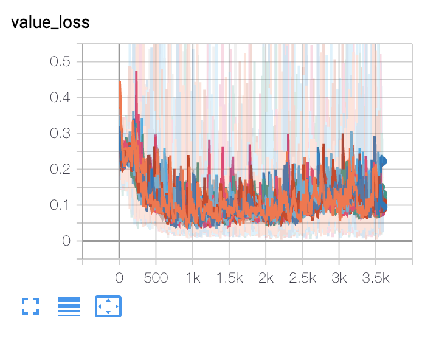
</div>

# Todo

- [x] Only CPU Training method
- [x] Distributed tensorflow
- [x] Model fix for preventing collapsed
- [ ] Training on GPU, Inference on CPU

# Reference

* [IMPALA: Scalable Distributed Deep-RL with Importance Weighted Actor-Learner Architectures](https://arxiv.org/abs/1802.01561)
* [deepmind/scalable_agent](https://github.com/deepmind/scalable_agent)
* [Asynchronous_Advatnage_Actor_Critic](https://github.com/alphastarkor/distributed_tensorflow_a3c)
