# Implementation of IMPALA with Distributed Tensorflow


## Information

* These results are from only 20 threads.
* Tensorflow Implementation
* Use distributed tensorflow to implement Actor
* Training with 2 hours
* Same parameter of [paper](https://arxiv.org/abs/1802.01561)
```
start learning rate = 0.0006
end learning rate = 0
learning frame = 1e6
gradient clip norm = 40
trajectory = 20
batch size = 32
reward clipping = -1 ~ 1
```


## Dependency

```
tensorflow==1.14.0
gym[atari]
numpy
tensorboardX
opencv-python
```

## Schema

<div align="center">
  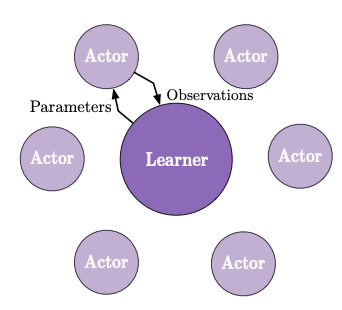
</div>

## How to Run

* learner

```shell
python trainer.py --num_actors=20 --task=0 --batch_size=32 --queue_size=128 --trajectory=20 --learning_frame=1000000000 --start_learning=0.0006 --end_learning=0.0 --discount_factor=0.99 --entropy_coef=0.05 --baseline_loss_coef=1.0 --gradient_clip_norm=40.0 --job_name=learner --reward_clipping=abs_one &
```

* actor

```shell
for i in $(seq 0 19); do
    python trainer.py --num_actors=20 --task=$i --batch_size=32 --queue_size=128 --trajectory=20 --learning_frame=1000000000 --start_learning=0.0006 --end_learning=0.0 --discount_factor=0.99 --entropy_coef=0.05 --baseline_loss_coef=1.0 --gradient_clip_norm=40.0 --job_name=actor --reward_clipping=abs_one &
done;
wait
```

## Result

### Video

<div align="center">
  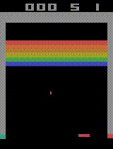
  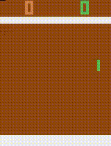
  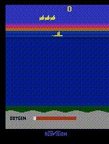
  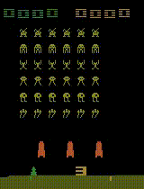
</div>

### Plotting

* Breakout
  
<div align="center">
  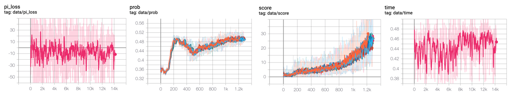
  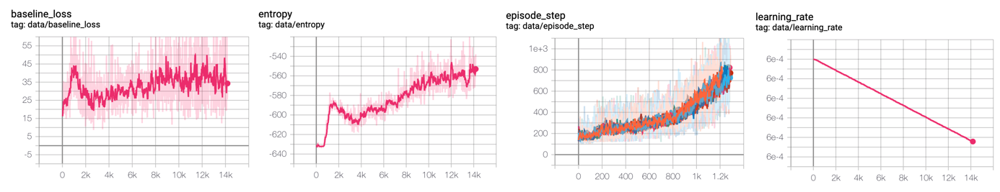
</div>

* Pong
  
<div align="center">
  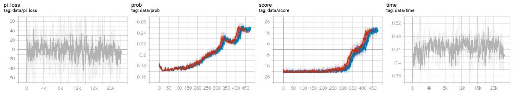
  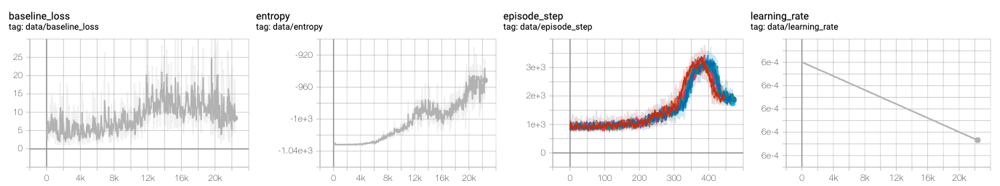
</div>

* Seaquest

<div align="center">
  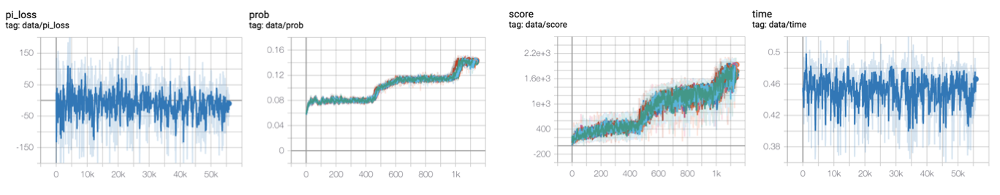
  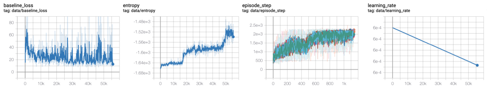
</div>

* Space Invader

<div align="center">
  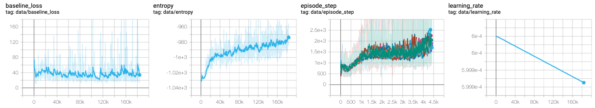
  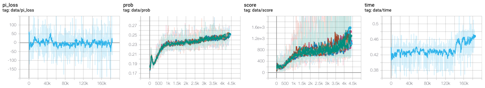
</div>


# Todo

- [x] Only CPU Training method
- [x] Distributed tensorflow
- [x] Model fix for preventing collapsed
- [ ] Training on GPU, Inference on CPU

# Reference

1. [IMPALA: Scalable Distributed Deep-RL with Importance Weighted Actor-Learner Architectures](https://arxiv.org/abs/1802.01561)
2. [deepmind/scalable_agent](https://github.com/deepmind/scalable_agent)
3. [Asynchronous_Advatnage_Actor_Critic](https://github.com/alphastarkor/distributed_tensorflow_a3c)
