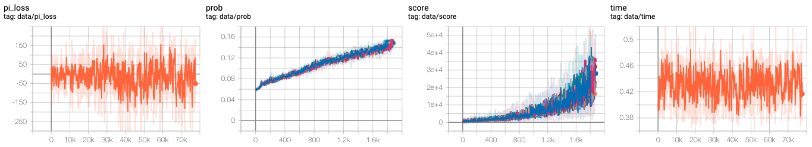
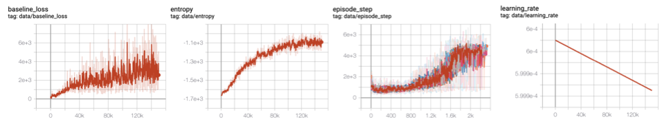

# Implementation of IMPALA with Distributed Tensorflow


## Information

* These results are from only 32 threads.
* A total of 32 CPUs were used, 4 environments were configured for each game type, and a total of 8 games were learned.
* Tensorflow Implementation
* Use DQN model to inference action
* Use distributed tensorflow to implement Actor
* Training with 1 day
* Same parameter of [paper](https://arxiv.org/abs/1802.01561)
```
start learning rate = 0.0006
end learning rate = 0
learning frame = 1e6
gradient clip norm = 40
trajectory = 20
batch size = 32
reward clipping = -1 ~ 1
```


## Dependency

```
tensorflow==1.14.0
gym[atari]
numpy
tensorboardX
opencv-python
```

## Overall Schema

<div align="center">
  
</div>

## Model Architecture

<div align="center">
  
</div>

## How to Run

* show [start.sh](start.sh)
* Learning 8 types of games at a time, one of which uses 4 environments.

## Result

### Video

|||||
|:---:|:---:|:---:|:---:|
|  |  |  |  |
| Breakout | Pong | Seaquest | Space-Invader |
|  |  | | |
| Boxing | Star-Gunner | Kung-Fu | Demon |

### Plotting


## Compare reward clipping method

### Video

|||
|:---:|:---:|
|  |  |
| abs_one | soft_asymmetric |

### Plotting
||
|:---:|
| 
 |
| abs_one |
| 
 |
| soft_asymmetric |

## Is Attention Really Working?

|||
|:---:|:---:|
|  |

* Above Blocks are ignored.
* Ball and Bar are attentioned.
* Empty space are attentioned because of less trained.

# Todo

- [x] Only CPU Training method
- [x] Distributed tensorflow
- [x] Model fix for preventing collapsed
- [x] Reward Clipping Experiment
- [x] Parameter copying from global learner
- [x] Add Relational Reinforcement Learning
- [x] Add Action information to Model
- [x] Multi Task Learning
- [x] Add Recurrent Model
- [ ] Training on GPU, Inference on CPU

# Reference

1. [IMPALA: Scalable Distributed Deep-RL with Importance Weighted Actor-Learner Architectures](https://arxiv.org/abs/1802.01561)
2. [deepmind/scalable_agent](https://github.com/deepmind/scalable_agent)
3. [Asynchronous_Advatnage_Actor_Critic](https://github.com/alphastarkor/distributed_tensorflow_a3c)
